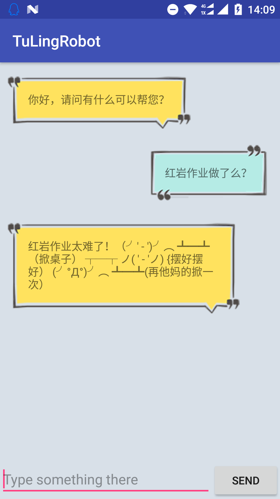
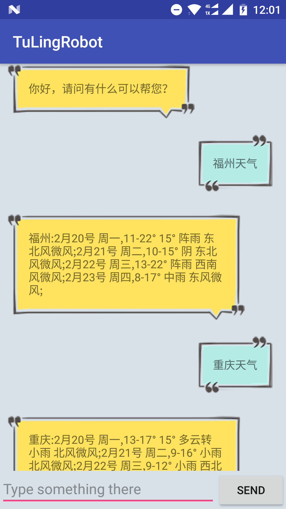
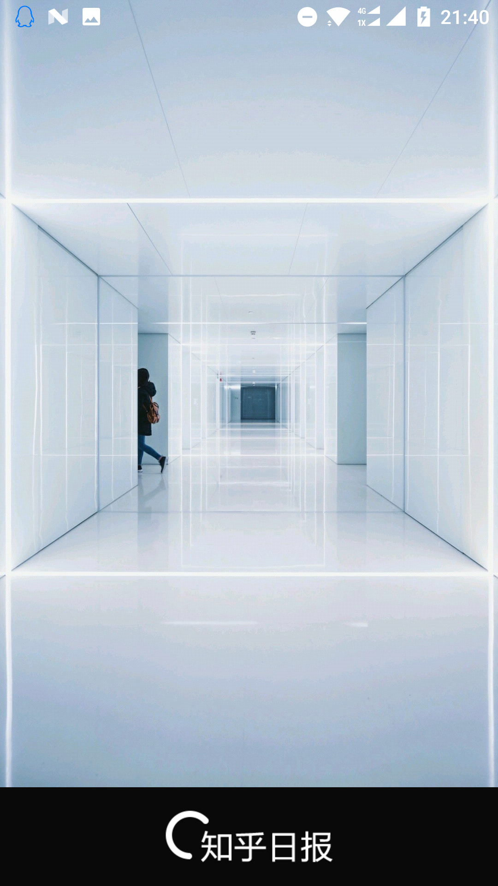
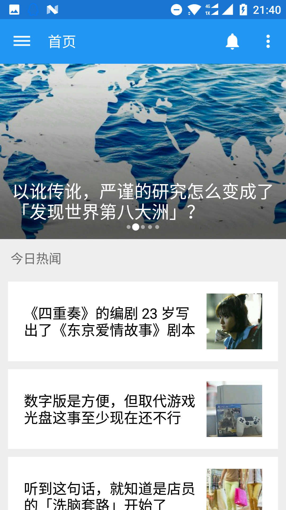
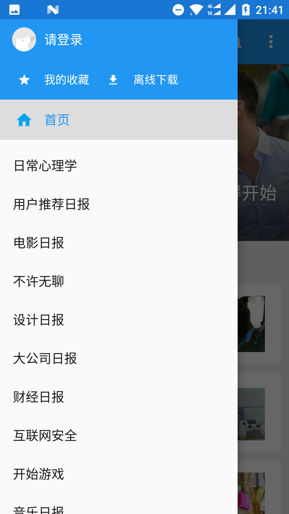

#红岩网校寒假作业
##1、图灵机器人
采用了图灵机器人官方API，官方旧版改用GET方式的http://www.tuling123.com/openapi/api?key=xxx&info=xxx   官方新版改用POST，请求格式为json。本程序采用了新版的POST写法。采用HttpURLConnecttion和JSONObject来请求和解析。效果如下： 
  
##2、知乎日报
官方的启动界面图片获取API失效，重新抓取得到新的API：https://news-at.zhihu.com/api/7/prefetch-launch-images/1080*1668   返回JSON格式如下：  
>{ 
　"creatives": [ 
   　　 { 
      　　　"url": "https://pic4.zhimg.com/v2-d68cefa1320e27b6fc2bd0fdaec760b7.jpg", 
     　　　 "text": "Alessio Lin", 
    　　　  "start_time": 1487562230, 
    　　  　"impression_tracks": [ 
       　　 "https://sugar.zhihu.com/track?vs=1&ai=3240&ut=&cg=2&ts=1487562230.18&si=cd5e6c28423f48a8b3bf1edac7290995&lu=0&hn=ad-engine.ad-engine.f457d044&at=impression&pf=PC&az=11&sg=4b61e227af28c4b0dc663942d9fb9a9f"], 
     　　 "type": 0, 
     　　 "id": "3240" 
   　　 } 
 　 ] 
}

实现了：启动界面，主页，侧边栏，文章查看， 阅后变色。 
未实现的功能：评论、收藏、本地缓存。 
未解决的问题： 
1. 想在启动的splash界面获取首页数据后传输给mainActivity，报错，失败. 
2. 只添加首页的下拉加载更多，没有其他板块下拉获取更多的api末尾数规律。 
3. 文章内容曾采用过嵌套WebView的ViewPager来显示，由于采用了打开时请求所有内容加载过慢，去掉ViewPager无法左右滑动。 

其他大多数都尽量得模仿原版，效果如下：  
  
  